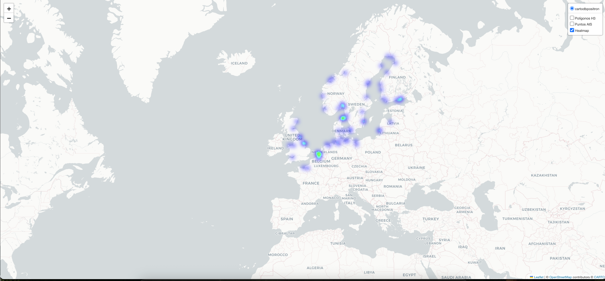

# Replicación de metodo existente - Clustering Marítimo con H3 y DBSCAN

Este proyecto implementa paso a paso la metodología presentada en Paper 2024 para detectar zonas marítimas relevantes utilizando datos AIS discretizados con **H3** y agrupados mediante **DBSCAN**.

## 🔁 Flujo General del Proyecto

1. **Carga y limpieza** de datos AIS.
2. **Filtrado por densidad** de puntos en celdas H3 (resolución 8).
3. **Agrupamiento (clustering)** de hexágonos con DBSCAN.
4. **Construcción de polígonos** a partir de los hexágonos agrupados.
5. **Visualización en mapa interactivo** (heatmap + clusters).

---
## ⚙️ Descripción de Módulos

### `loader.py`
- Carga el dataset en formato **Parquet** como un DataFrame Dask.
- Define `load_data()`.

### `cleaner.py`
- Filtra columnas inválidas o sin uso.
- Convierte fechas, elimina `NaN`, y normaliza estados.
- Define `clean_data(df)`.

### `density_filter.py`
- Agrupa por celdas H3 (res_8) y elimina aquellas con < 30 registros.
- Define `filter_low_density(df)`.

### `h3_cluster.py`
- Calcula el centroide de cada celda H3.
- Aplica DBSCAN sobre los centroides.
- Asocia cada celda a un `cluster_id`.
- Define `cluster_hexagons(df)`.

### `h3_to_polygons.py`
- Convierte cada celda H3 a un polígono con geometría válida.
- Define `attach_geometry(df)`.

### `map_folium.py`
- Crea mapa interactivo:
  - Capa de **polígonos H3 agrupados** por color.
  - **Puntos AIS** coloreados dinámicamente por estado de navegación.
  - **Heatmap** con densidad de tráfico marítimo.
- Define `create_interactive_map(gdf_hulls, df_points, color_map)`.

---

## Cómo Ejecutar

```bash
pip install -r requirements.txt
```

```bash
python main.py
```
# Resultados Obtenidos



